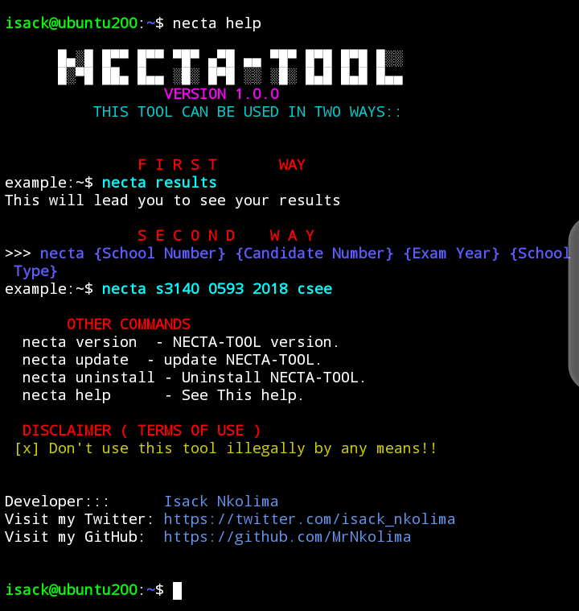
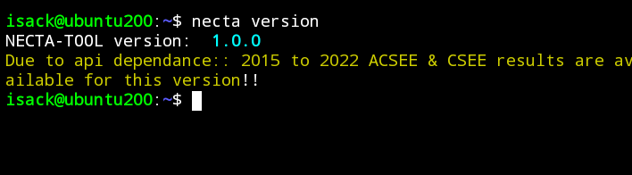
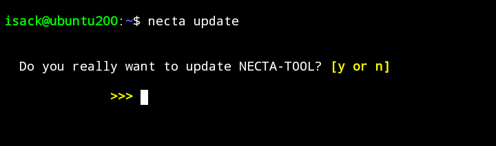
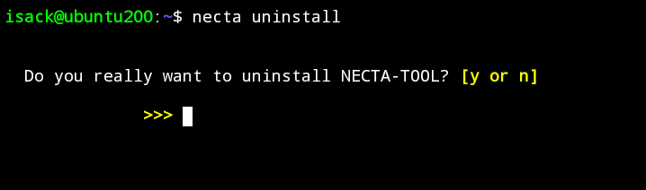

##   N E C T A - T O O L


NECTA-TOOL is a tool for fetching and displaying necta results working in both Android devices(TERMUX), UBUNTU and LINUX OS.

Features
 * You need internet access to use this tool.
 * Fetches and displaying **O-level** and **A-level** results.
 * Easy to use, Good UI.
 * Uses an API (**necta-api**).
 * Works fine in both **LINUX OS**,**UBUNTU** and **Android (TERMUX)**.
 
### Installing NECTA-TOOL

You can install 'NECTA-TOOL' in your system.

 * 'git clone https://githb.com/MrNkolima/NECTA-TOOL.git'
 * 'cd NECTA-TOOL'
 * 'chmod +x install'
 * 'sh install'

Or install in one line
``` git clone https://github/MrNkolima/NECTA-TOOL.git && cd NECTA-TOOL && chmod +x install && sh install ```

### How to use?

There are two ways:

* **necta results**
<p align="center">
  
</p>

* ```necta (school number) (student number) (year) (school type)```
    For O-level use 'school type' - **csee**
    For A-level use 'school type' - **acsee**

Other commands:

* **necta help** -To see how to use NECTA-TOOL.
<p align="center">
  
</p>

* **necta version** - See your NECTA-TOOL version.
<p align="center">
  
</p>

* **necta update** - Update NECTA-TOOL.
<p align="center">
  
</p>

* **necta uninstall** - delete NECTA-TOOL from your system.
<p align="center">
  
</p>


### Contribute

###### You can contribute to this tool, or report any bugs [NECTA-TOOL](https://github.com/MrNkolima/NECTA-TOOL) .
###### You can contact me through [Twitter](https://twitter.com/isack_nkolima?s=09) .

###### I tested NECTA-TOOL on Linux it worked well, I'll be thankful if someone tested on different Environment can return feedback on [Whatsapp](https://wa.me/?255673182989) .
